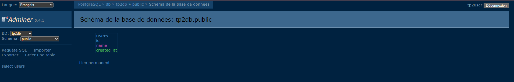

# TP2 – Multi-Services Deployment with Docker Compose

> Projet pédagogique – Infrastructure & Orchestration de données  
> Environnement : WSL (Ubuntu) · VS Code · Docker Compose

---

##  Présentation

Ce projet illustre le déploiement d’une application multi-services à l’aide de Docker Compose.  
Il met en œuvre une architecture backend réaliste intégrant une API, une base de données relationnelle, un outil d’administration et un service annexe.

---

## Stack technique

- Docker
- Docker Compose
- Python 3.11
- FastAPI
- PostgreSQL
- Adminer
- Redis
- WSL2 (Ubuntu)
- VS Code

---

##  Architecture

- API FastAPI exposée sur le port 8000
- Base de données PostgreSQL avec persistance via volume Docker
- Interface Adminer pour l’administration de la base
- Service Redis comme composant annexe
- Communication via un réseau Docker dédié

---

## Structure du projet

```text
tp2-docker-compose/
├── app/
│   ├── Dockerfile
│   ├── main.py
│   └── requirements.txt
│
├── docker-compose.yml
├── .env
├── .gitignore
└── README.md
```md
## Résultat attendu


